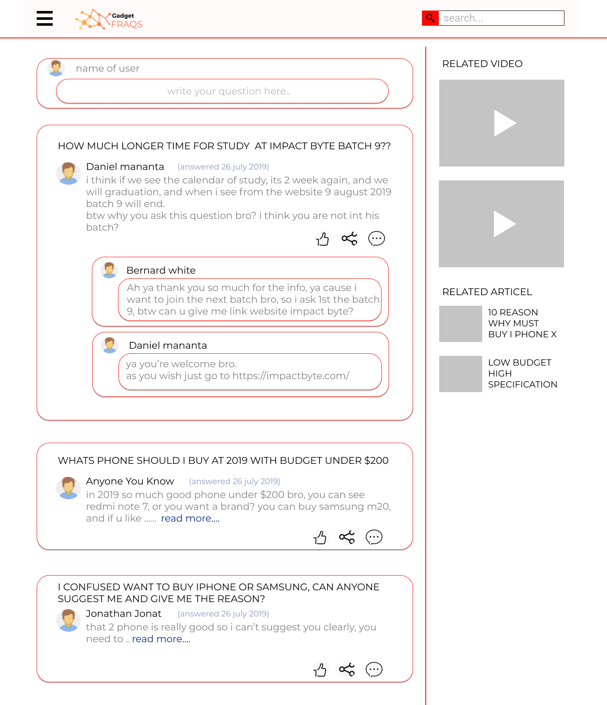
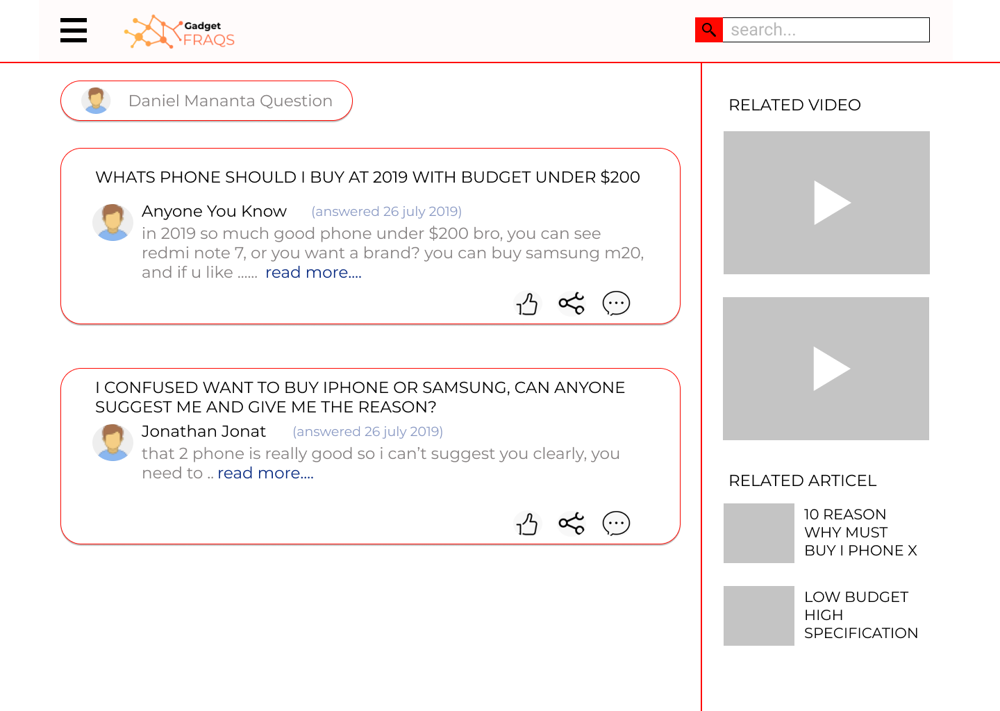

# Gadget Fraqs

## Introduction

Schedule week 1:

-   Saturday & Sunday: Design using Figma
-   Monday & Tuesday: Implement frontend and backend
-   Wednesday & Thursday: Deploy backend to Heroku
-   Friday: add Redux, connect frontend and backend

Schedule week 2:

-   Monday & Tuesday:
-   Wednesday & Thursday:
-   Friday:
-   Saturday: Presentation final project

## Create

-   Design using Figma
-   Fontend built with React and Redux
-   Backend built Node, Express, Sequelize (MySQL) and JWT Auth

## Link

-   Organization:
    -   https://github.com/final-project-igneel
-   Repositories:
    -   https://github.com/final-project-igneel/react-frontend
    -   https://github.com/final-project-igneel/api-backend

## Features

-   Responsive UI for React
-   Database migration and data seeding
-   User authentication using JSON Web Tokens
-   Can login via Facebook and Google

## Design

Figma: https://www.figma.com/file/xHh7L9OdeJcizlk6J6x1GE/FINAL-PROJECT?node-id=0%3A1

## License

-   MIT License
